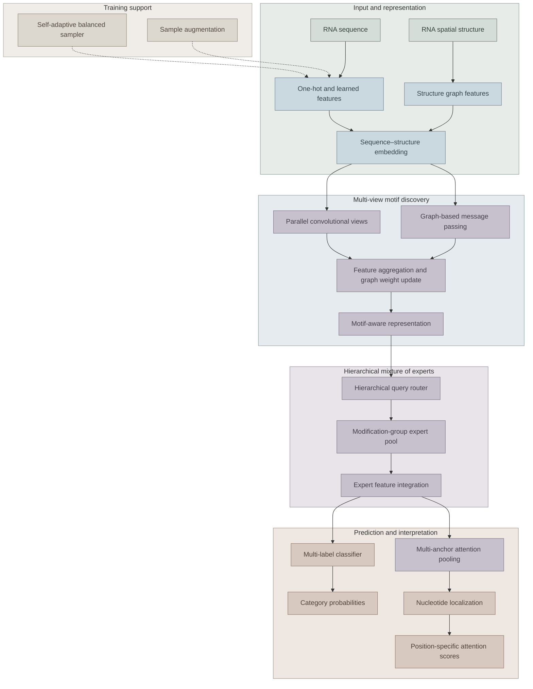
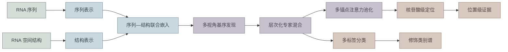
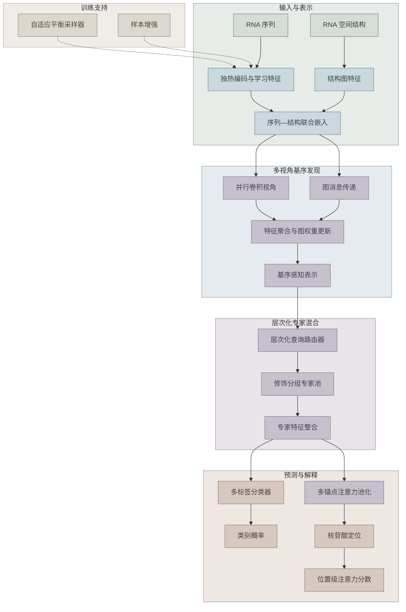

# mRModN

## Long-context RNA modification detection and nucleotide-level localization

<a href="#english">English</a> · <a href="#chinese">中文</a>

## English

### Project overview

mRModN is a deep learning framework for multi-category RNA modification analysis. It integrates long-context sequence modeling, RNA spatial structure representation, motif discovery, hierarchical expert routing, and class-aware attention to support both global modification classification and nucleotide-level localization.

The framework is designed for biological sequence analysis across multiple organisms, modification categories, and sequencing technologies. Its outputs can be examined at the prediction level and at the level of the sequence or structural patterns that support each prediction.

### Project organization

mRModN is composed of five independent project repositories. Each repository has its own environment, data protocol, training or analysis entry points, and output management. This repository is the **mRModN project homepage and documentation hub**. It provides the project overview, methodological guidance, repository navigation, and usage context; it does not contain the training data or serve as the runtime dependency of the five independent projects.

| Repository                                      | Primary responsibility                                                              |
| ----------------------------------------------- | ----------------------------------------------------------------------------------- |
| [`human`](https://github.com/your-org/human)   | Human RNA modification prediction, model training, evaluation, and model comparison |
| [`plant`](https://github.com/your-org/plant)   | Plant RNA modification analysis and cross-species transfer evaluation               |
| [`ac4c`](https://github.com/your-org/ac4c)     | Focused ac4C prediction under balanced and unbalanced evaluation protocols          |
| [`3gen`](https://github.com/your-org/3gen)     | Third-generation and direct RNA sequencing analysis and generalization studies      |
| [`visual`](https://github.com/your-org/visual) | Offline visualization of attention, motifs, RNA structure, and model outputs        |

### From sequence to interpretable prediction

RNA modification prediction involves several related challenges: one RNA sequence may contain multiple modification types; informative signals may extend beyond a short fixed window; sequence order and RNA spatial structure provide complementary evidence; and modification classes are often strongly imbalanced. mRModN addresses these challenges in one sequence–structure modeling pipeline.

```mermaid
flowchart LR
    S[RNA sequence] --> SEQ[Sequence representation]
    R[RNA spatial structure] --> STR[Structure representation]
    SEQ --> EMB[Joint sequence–structure embedding]
    STR --> EMB
    EMB --> MOTIF[Multi-view motif discovery]
    MOTIF --> EXPERT[Hierarchical mixture of experts]
    EXPERT --> CLASS[Multi-label classification]
    EXPERT --> ATT[Multi-anchor attention pooling]
    ATT --> LOC[Nucleotide-level localization]
    CLASS --> PROFILE[Modification profile]
    LOC --> EVIDENCE[Position-specific evidence]

    classDef input fill:#D5DDD8,stroke:#718078,color:#35423C,stroke-width:1px
    classDef representation fill:#CAD8E0,stroke:#718692,color:#35434C,stroke-width:1px
    classDef core fill:#C7C1CE,stroke:#817789,color:#443F4B,stroke-width:1px
    classDef output fill:#D8C9C0,stroke:#907B6D,color:#4E4139,stroke-width:1px
    class S,R input
    class SEQ,STR,EMB representation
    class MOTIF,EXPERT,ATT core
    class CLASS,LOC,PROFILE,EVIDENCE output
```

### Model architecture

The architecture is organized into four stages: input representation, structure-aware motif discovery, hierarchical expert modeling, and interpretable prediction. The design preserves information from both the primary sequence and the folded RNA topology.

### Core components

#### 1. Sequence–structure embedding

The input layer represents an RNA sequence together with its spatial structure. Sequence features preserve nucleotide identity and local order, while structure features describe relationships between nucleotides that may be distant in the primary sequence but close in the folded RNA molecule.

#### 2. Multi-view Motif Discovery

Parallel convolutional operations capture motifs at different sequence scales. Structure-aware graph message passing aggregates information from structurally related nucleotides. The combined representation retains both local sequence motifs and dependencies that are not visible from sequence order alone.

#### 3. Hierarchical Mixture of Experts

A hierarchical query router assigns each embedded RNA context to appropriate expert groups. Related modification categories can share information while retaining category-specific features, reducing interference between heterogeneous prediction targets.

#### 4. Multi-Anchor Attention Pooling

Class-aware attention is distributed over nucleotide positions through multiple attention anchors. The same forward pass therefore produces both a global probability for each modification category and a ranked set of candidate positions associated with that category.

#### 5. Self-Adaptive Balanced Sampler

The sampler adjusts the training composition to improve the representation of minority categories while preserving the diversity of the original data. It is a training strategy and does not change the interpretation of final prediction scores.

### Inputs and outputs

**Inputs**

- RNA nucleotide sequence
- RNA spatial or secondary-structure representation, when available
- Modification labels for supervised training
- Dataset and species information for independent evaluation or transfer analysis

**Outputs**

- Multi-label modification probabilities
- Modification-specific nucleotide localization scores
- Ranked candidate positions for each modification category
- Attention distributions and motif-level evidence for interpretation
- Evaluation results across datasets, organisms, and sequencing technologies

### Research capabilities

- **Multi-label prediction:** multiple modification categories can be predicted for the same sequence window.
- **Nucleotide-level localization:** class-aware attention connects each predicted category to candidate nucleotide positions.
- **Long-context modeling:** extended sequence context is retained to capture distributed biological signals.
- **Sequence–structure integration:** primary sequence and RNA folding relationships are modeled jointly.
- **Cross-domain evaluation:** learned representations can be assessed across species, datasets, and sequencing technologies.
- **Interpretable analysis:** attention, motifs, structure-aware graphs, and position-specific scores support biological inspection.

### Typical workflow

### Citation and license

When using mRModN or any independent project repository, please cite the associated project publication and identify the repository, dataset protocol, model checkpoint, and evaluation setting used in the analysis. License information is provided in each independent repository together with its source code, data usage terms, and third-party software notices.

<a href="#top">Back to top</a> · <a href="#chinese">中文</a>

## 中文

### 项目简介

mRModN 是一个面向多类别 RNA 修饰分析的深度学习框架。该框架融合长上下文序列建模、RNA 空间结构表示、基序发现、层次化专家路由和类别感知注意力，用于同时完成 RNA 修饰的整体分类与核苷酸级定位。

项目面向多物种、多修饰类别和多种测序技术下的生物序列分析。模型输出不仅可以用于判断 RNA 中可能存在的修饰类型，还可以进一步分析支持预测的序列模式与结构模式。

### 项目组成

mRModN 由五个相互独立的项目仓库组成。每个仓库拥有独立的运行环境、数据协议、训练或分析入口以及输出管理方式。当前仓库是 **mRModN 的项目首页与说明导航中心**，用于介绍项目目标、解释方法流程、提供仓库导航和使用指引；本仓库不承担训练数据存储，也不是五个独立项目运行时的依赖。

| 仓库                                            | 主要职责                                     |
| ----------------------------------------------- | -------------------------------------------- |
| [`human`](https://github.com/your-org/human)   | 人类 RNA 修饰预测、模型训练、评估与模型比较  |
| [`plant`](https://github.com/your-org/plant)   | 植物 RNA 修饰分析与跨物种迁移评估            |
| [`ac4c`](https://github.com/your-org/ac4c)     | 在平衡与非平衡评估协议下开展 ac4C 专项预测   |
| [`3gen`](https://github.com/your-org/3gen)     | 第三代测序与直接 RNA 测序分析及泛化研究      |
| [`visual`](https://github.com/your-org/visual) | 注意力、基序、RNA 结构和模型输出的离线可视化 |

表格中的链接暂时使用占位组织名 `your-org`。创建五个独立 GitHub 仓库后，应将其替换为实际的 GitHub 组织名或用户名。

### 从序列到可解释预测

RNA 修饰预测面临多个相互关联的问题：同一条 RNA 序列可能包含多种修饰；有效信号可能超出短窗口范围；序列顺序和 RNA 空间结构提供互补信息；不同修饰类别之间通常存在明显的数据不平衡。mRModN 将这些问题统一到序列—结构建模流程中。

### 模型结构

模型由四个阶段组成：输入表示、结构感知基序发现、层次化专家建模以及可解释预测。整体设计同时保留 RNA 的一级序列信息与折叠后的空间拓扑信息。

### 核心模块

#### 1. 序列—结构联合嵌入

输入层将 RNA 序列与空间结构共同表示。序列特征保留核苷酸身份和局部顺序，结构特征描述在一级序列中可能相距较远、但在折叠分子中彼此接近的核苷酸关系。

#### 2. 多视角基序发现

并行卷积操作从不同序列尺度提取基序，结构感知的图消息传递则聚合空间相关核苷酸的信息。两类信息经过融合后，既保留局部序列基序，也保留单纯依靠序列顺序难以观察到的结构依赖关系。

#### 3. 层次化专家混合

层次化查询路由器将 RNA 上下文分配给合适的专家分组。相关修饰类别可以共享信息，同时保留类别特异性特征，从而降低不同预测目标之间的相互干扰。

#### 4. 多锚点注意力池化

模型通过多个注意力锚点在核苷酸位置上形成类别感知的注意力分布。因此，一次前向计算可以同时产生每种修饰的整体概率，以及与该修饰相关的候选核苷酸位置排序。

#### 5. 自适应平衡采样器

采样器调整训练数据组成，使少数类别获得更充分的表示，同时保持原始数据的多样性。该模块属于训练策略，不改变最终预测分数的含义。

### 输入与输出

**输入**

- RNA 核苷酸序列
- RNA 空间结构或二级结构表示（可选）
- 用于监督训练的修饰标签
- 用于独立评估或迁移分析的数据集与物种信息

**输出**

- 多标签修饰概率
- 针对具体修饰类别的核苷酸定位分数
- 每种修饰类别的候选位置排序
- 用于解释的注意力分布与基序证据
- 跨数据集、物种和测序技术的评估结果

### 研究能力

- **多标签预测：** 同一序列窗口可以同时预测多个 RNA 修饰类别。
- **核苷酸级定位：** 类别感知注意力将预测类别连接到候选核苷酸位置。
- **长上下文建模：** 保留扩展序列上下文，以捕获分布范围更广的生物学信号。
- **序列—结构融合：** 联合建模一级序列与 RNA 折叠产生的空间关系。
- **跨域评估：** 支持在不同物种、数据集和测序技术之间评估表示的迁移能力。
- **可解释分析：** 通过注意力、基序、结构图和位置级分数辅助生物学分析。

### 典型工作流程

### 引用与许可

使用 mRModN 或其独立项目仓库时，请引用相关项目成果，并注明所使用的仓库、数据协议、模型检查点和评估设置。许可信息将随各独立仓库的源代码、数据使用条款和第三方软件声明一并提供。

<a href="#top">返回顶部</a> · <a href="#english">English</a>
